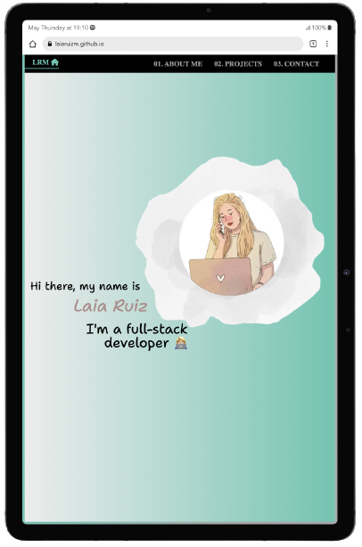

<p align="center" style="margin-center:8%">

</p>

If you want to see the project: https://laiaruizm.github.io/portfolio/

# PORTFOLIO 📓 | LaiaRuizM

- Hi there people! 👋🏻
- My name is Laia Ruiz Martínez and this is my **portfolio**.

## -- About this project 📋🙋🏼‍♀️ --

- Here you can find a little bit more information about me, all my projects, social networks and email. Also, you can download my resume. Welcome on board!

## -- Screenshots --



## -- Table of contents --

- [-- Overview --](#overview)
  - [Links](#links)
  - [Further implementations](#further-implementations)
- [-- Project's process --](#projects-process)
  - [Organization](#organization)
  - [Built with programming languages & tools 🛠️](#built-with)
  - [Setup for getting started](#setup)
  - [Challenges I have faced 🤖](#challenges)
- [-- Author --](#author)
- [--Additional information for the setup--](#additional-information)

## Overview

### Links

- Live code: [https://github.dev/LaiaRuizM/portfolio](https://github.dev/LaiaRuizM/portfolio)
- Project's website: [https://laiaruizm.github.io/portfolio/](https://laiaruizm.github.io/portfolio/)

### Further implementations

- Adding a button to toggle the portfolio in Dark or Light mode.
- Adding a buttom with the translation in English and Spanish.

## Project's process

### Organization

1. Design the prototype project, estimate time and create a basics Readme
2. Write down the main components and its styles: Home, Header, AboutMe
3. Structure and create the JSON which all the projects
4. Create ProjectList and ProjectItem components and its styles
5. Create Contact's component
6. Update styles
7. Fix errors and problems
8. Think about future implementations
9. Update Readme

### Built with

1. HTML 📌
1. SCSS / SASS 🔗
1. JS ♡
1. ReactJS ⚡️
1. NPM 🖌️
1. Git / GitHub 📂
1. VISUAL STUDIO CODE (VSC) 🗄️

### Setup

1. Clone the repo: `https://github.com/LaiaRuizM/portfolio.git` using:

```bash
 git clone
```

2. Once you've download or cloned the project, install it with NPM packages:

```bash
npm install
```

3.  After that, if you want to run it in local, execute this command:

```bash
npm start
```

### Challenges

- The border of the website on the Projects section was in the middle of the page and not until the end with all the view height. To be able to see the problem I simplified the code, after seeing that the problem was in the App component I started to comment each component and after realized in which component I had the problem (ProjectList), I reviewed the code and changed the style which was making the height's problem.

## Author

💡 If you want to contact me for any suggestion, doubts, contributions, Pull Request. Feel free to ask me if you have any question or curiosity:

- Email: [laia.ruizm@hotmail.com](laia.ruizm@hotmail.com)
- Linkedin: [https://www.linkedin.com/in/laia-ruiz-martínez/](https://www.linkedin.com/in/laia-ruiz-martínez/)
- GitHub: [https://github.com/LaiaRuizM](https://github.com/LaiaRuizM)

«All you need is attitude. Aim for the stars so that if you miss, you will still get to the moon». 🙋🏼‍♀️

Made with 💙 by [Laia](https://github.com/LaiaRuizM)

## Additional information

### What can I find in this exercise?

> **NOTE:** In this exercise, you can find the following files and folders:

1. The folder 📂 `src/` contains the files for this website: HTML, SCSS, JavaScript, and images.
1. The folders 📚 `public/` and `docs/` are automatically generated when we start the project. GULP reads the files in the src/ folder, processes them, and then generates them inside the `public/` and `docs/` folders.
1. The individual files 📝 that are loose in the repository root, such as gulpfile.js, package.json... are the project configuration files and we do not need to modify them.

### How can I start from scratch?

> **NOTE:** Below are the steps to follow:

1. **Make sure you have Node JS installed / install it** to work with the Starter Kit.
1. **Create your own repository**. NOTE: Be very aware of the folder where you are at all times.
1. Download the **Adalab Starter Kit from GitHub**.
   - As a recommendation: Avoid cloning the repo, because if you do, you won't be able to add commits.
1. **Copy all the files** from the Starter kit to the root folder of your repository.
   - Remember to copy also the **hidden files** (IMPORTANT!)
   - If you decide to clone the repo, avoid copying the `.git` folder. Because, if you do, you will be overwriting your own repository.
1. **Open a terminal** in the **root** folder of your repository.
1. **Install the local dependencies** by executing the command in the terminal:

```bash
   npm install
```

### How can I run the project?

> **NOTE:** The project must be started every time you start programming.

- To start it, run the command:

```bash
npm start
```

**What does this command do?**

- **Opens a Chrome window and shows your web page**. It is the same as the VS Code Live Server plugin (Go live).
- Additionally, **observes** all the files inside the `src/` folder. Every time you modify a file, **refresh your page in Chrome**.
- It also **processes** the HTML, SASS/CSS, and JS **files** and **generates and saves them in the `public/` folder**. For example:
  - Converts the SASS files to CSS.
  - Combines the different HTML files and groups them into one or several HTML files.

After running `npm start`, you can start editing all the files inside the `src/` folder and programming.

### How can I publish the project on GitHub Pages?

To generate your page for production, run the command:

```bash
npm run docs
```

Then:

1. In the explorer, a folder named `docs/` will have been created. If it does not appear at first, refresh!
2. In the terminal, type git add -A, git commit -m "run docs" and git push.
3. Go to the `settings` tab of your repo -> "code and automation" -> in the GitHub Pages section, activate the **master branch /docs folder** option -> save -> refresh. (IMPORTANT!).
4. It may take a while to create it, due to the deployment. Once the URL has been generated, you can send it.
5. As a recommendation: Add this URL on the main page of the project, in the ABOUT section.
